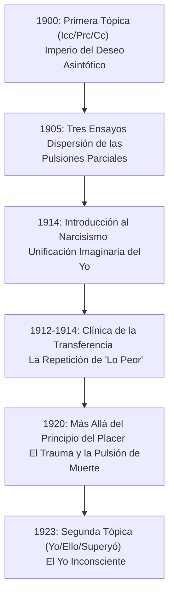

# 📖 GUÍA DOCENTE: ARTICULACIÓN Y DESARROLLO DE LA CLASE 13
## *Los Límites del Placer, la Repetición y la Segunda Tópica*

Esta guía está diseñada para estructurar la clase teórica articulando el recorrido histórico-clínico del programa y utilizando las explicaciones, conceptos clave y metáforas clínicas extraídas de los teóricos desgrabados de la UNLP.

---

## 🗺️ PARTE I: EL CAMINO RECORRIDO (Cómo llegamos hasta aquí)

Para que los alumnos comprendan el terremoto teórico de 1920, es fundamental recordarles las estaciones previas de este viaje metapsicológico. El psicoanálisis no cambió de mapa por capricho especulativo, sino porque la clínica desbordó los diques conceptuales previos.



### 1. El Imperio del Deseo Asintótico (1900)
*   **La Primera Tópica:** Nacida del Capítulo VII de *La interpretación de los sueños*, organiza el aparato en un mapa espacial virtual (*topos*): **Inconsciente (Icc), Preconsciente (Prc) y Conciencia (Cc)**.
*   **El motor es el Deseo:** El aparato no es reactivo a los estímulos del exterior; su fuerza motriz es el deseo.
*   **Deseo Asintótico:** El deseo humano no busca calmar una necesidad biológica, sino reencontrar las huellas mnémicas de la mítica primera vivencia de satisfacción. Como una curva asintótica, el deseo se acerca infinitamente al punto cero de descarga absoluta, pero por estructura, **nunca llega a tocarlo**. Hay un malentendido de origen; el deseo queda siempre insatisfecho y motoriza el aparato.
*   **El Principio del Placer:** En esta época, el aparato se rige por la tendencia a evitar el displacer (aumento de tensión) y buscar el placer (descarga/atenuación).

### 2. La Anarquía de las Pulsiones Parciales (1905)
*   **Desarticulación del sentido común:** En *Tres ensayos de teoría sexual*, Freud desmonta la definición popular de la sexualidad (que suponía que nacía en la pubertad, tenía por objeto al otro sexo y por meta el coito reproductivo).
*   **La sexualidad infantil como Frankenstein:** Freud demuestra que la sexualidad humana es una anarquía de **pulsiones parciales** ligadas a bordes y orificios corporales (zonas erógenas: boca, ano, ojos). Cada pulsión parcial (oral, anal, escópica) busca su satisfacción de manera independiente y ciega, de forma autoerótica. No hay una integración natural.

### 3. La Unificación del Yo por el Narcisismo (1914)
*   **El Yo no viene dado de entrada:** Al nacer hay puro autoerotismo (pulsiones fragmentadas). Para que se constituya un Yo, hace falta "un nuevo acto psíquico".
*   **Narcisismo como pegamento:** El niño se ve en el espejo (el mito de Narciso fascinado por su imagen) e intuye esa imagen como una unidad que aglutina sus pedazos. El Yo se ofrece entonces como objeto a ser amado por la libido, subordinando de forma relativa las pulsiones parciales bajo el primado del falo y la dialéctica del tener/no tener.

### 4. El Retorno Clínico: La Repetición en la Transferencia (1912-1914)
*   **Actuar en lugar de recordar:** En el dispositivo clínico, el paciente repite en acto su historia con sus primeros objetos en lugar de ponerla en palabras.
*   **La paradoja de "Lo Peor":** Si el aparato se rige por el principio del placer, esperaríamos que el paciente repitiera las escenas más felices de su pasado. Sin embargo, en la transferencia **el sujeto insiste en repetir lo peor**: los momentos de mayor humillación, rechazo y desengaño infantil. ¿Por qué el aparato insiste en reeditar el sufrimiento?

---

## 🌋 PARTE II: EL TERREMOTO DE 1920 (Más allá del principio del placer)

Freud se topa con fenómenos clínicos imposibles de explicar mediante la fórmula de la "búsqueda del placer". Este texto de "gran especulación y largo vuelo" pone a prueba los pilares metapsicológicos.

### 1. Las Excepciones que Destronan al Rey Placer
Freud aísla fenómenos donde la repetición no genera placer ni consciente ni inconsciente:
*   **Las Neurosis de Guerra (Traumáticas):** Los soldados de la Primera Guerra Mundial que, al dormir, sueñan una y otra vez con el horror de la explosión que casi los mata. No hay cumplimiento de deseo posible en revivir la amenaza de muerte; el sueño falla como guardián del reposo.
*   **El Juego del Fort-Da:** El nieto de Freud de año y medio tira un carretel de madera en su cuna tapada diciendo *"Fort"* (se fue) y luego lo recupera tirando del hilo diciendo *"Da"* (acá está). Aunque la segunda parte da placer, **el niño repite incansablemente la primera (la dolorosa desaparición)**. Repite de forma activa el trauma pasivo de la partida de su madre.
*   **La Transferencia Negativa:** El paciente que actualiza el rechazo y el dolor vincular con el terapeuta.
*   **La Compulsión de Destino:** Personas que tropiezan siempre con la misma piedra y creen ser perseguidas por un destino fatal. Freud evoca el mito medieval de **Tancredo y Clorinda** (en *La Jerusalén Liberada*): Tancredo mata en duelo a su amada Clorinda sin saberlo (pues llevaba la armadura enemiga). Al internarse desesperado en un bosque encantado, clava su espada en un árbol y del tronco mana sangre mientras escucha la voz de Clorinda reclamándole que la ha herido de nuevo. **Repetir activamente aquello que más se quiere evitar.**

### 2. La Metáfora de la Vesícula y la Protección Antiestímulo
Para explicar el trauma, Freud imagina el aparato psíquico como una **vesícula (una célula o esfera de sustancia estimulable)**:
*   **El Adentro y el Afuera:** El exterior tiene cantidades de energía infinitamente mayores que el interior.
*   **La Barrera Protectora (Piel/Corteza):** La función primordial de la membrana exterior no es percibir, sino **proteger contra los estímulos**, filtrándolos y reduciéndolos a una cantidad compatible con la vida del aparato.
*   **El Trauma:** Es la perforación de esta barrera protectora antiestímulo. Una inundación de energía libre invade el aparato sin ser atenuada.

```
       MUNDO EXTERIOR (Cantidades infinitas de energía)
                    │   │   │   │
                    ▼   ▼   ▼   ▼
             ┌─────────────────────┐
             │ BARRERA PROTECTORA  │  ◄─── [TRAUMA: Perforación de la barrera]
             └──────────┬──────────┘
                        │ (Inundación de energía libre)
                        ▼
             ┌─────────────────────┐
             │  APARATO PSÍQUICO   │  ◄─── [Urgencia: Ligar la energía libre]
             └─────────────────────┘
```

### 3. La Tarea Originaria de "Ligar" y la Metáfora del Titanic
*   **Ligar (Bindung):** Cuando el trauma ocurre, el principio del placer queda **destronado (suspendido)**. El aparato no puede dedicarse a buscar placer porque está en peligro de muerte por inundación energética. Su tarea previa, más originaria y vital, es **ligar (dominar, fijar)** esa energía libre a representaciones para poder tramitarla.
*   **La Metáfora del Titanic y el Pocillito:**
    > *"Imaginemos que vamos en el Titanic y se rompe el casco, empieza a entrar agua de forma masiva (trauma). El funcionamiento placentero del barco (la orquesta, la cena) se suspende. Lo único que nos queda es agarrar un pocillito de café y empezar a sacar agua desesperadamente (repetición compulsiva). Sacar agua con un pocillito no da placer, no soluciona el problema de fondo, pero es un intento desesperado de dominio y ligazón del exceso antes de que el barco se hunda. Solo cuando el nivel de agua esté controlado (energía ligada), podrá volver a funcionar la lógica del placer."*

### 4. La Pulsión de Muerte
*   Al destronar el principio del placer, Freud deduce que la pulsión no busca el progreso ni la evolución, sino el retorno a un estado anterior: la inercia absoluta de la materia inorgánica de la cual proviene la vida. La **pulsión de muerte (Tánatos)** opera silenciosamente buscando la desunión y el retorno a la inercia, en tensión constante con las pulsiones de vida (Eros) que intentan ligar y conservar la sustancia viva.

---

## 🏛️ PARTE III: LA RECONSTRUCCIÓN ESTRUCTURAL (El yo y el ello - 1923)

El descubrimiento de que el aparato debe lidiar con la pulsión de muerte y con resistencias que no responden al placer obliga a jubilar el modelo espacial de la Primera Tópica.

### 1. ¿Por qué cae la Primera Tópica?
*   **La Resistencia es Inconsciente:** En la clínica, Freud constata que el Yo reprime y opone resistencia a la cura. Pero el paciente **no sabe que se está defendiendo**. Su resistencia es profundamente inconsciente.
*   **La Paradoja del Yo:** Si el Yo (agente de la defensa) tiene una parte inconsciente, entonces "Inconsciente" ya no puede ser el nombre de un *lugar* o *sistema* (Icc) contrapuesto al Yo/Conciencia.
*   **De Sistema a Cualidad:** "Inconsciente" deja de ser una localización espacial y se convierte en una **cualidad** que puede calificar a procesos en cualquiera de las nuevas instancias.

### 2. El Nuevo Mapa: La Segunda Tópica

```
                      ┌───────────────────────┐
                      │      SUPER-YO         │ (Heredero del Edipo - Culpa y Ley)
                      └──────────┬────────────┘
                                 │ (Exigencias)
                                 ▼
   ┌───────────┐      ┌───────────────────────┐      ┌───────────┐
   │ REALIDAD  │ ◄─── │         YO            │ ◄─── │   ELLO    │ (Reservorio pulsional)
   └───────────┘      └───────────────────────┘      └───────────┘
                       (El jinete y el caballo)
```

*   **El Ello:** El gran reservorio pulsional. Es caótico, desorganizado, inconsciente y se rige puramente por el proceso primario. Es el "caballo salvaje" que provee la energía.
*   **El Yo:** El "jinete" que intenta dominar al caballo del Ello. Se forma a partir de las identificaciones con los objetos que el Ello debió perder. Tiene una parte vuelta a la realidad (percepción-conciencia) pero, fundamentalmente, sus mecanismos de defensa y raíces son **inconscientes**.
*   **El Superyó:** El heredero del Complejo de Edipo. Internaliza la ley y la prohibición parental, pero se alimenta de la energía agresiva del Ello para juzgar ferozmente al Yo. Es la fuente de la culpa inconsciente y el sentimiento de castigo.

---

## 📝 SUGERENCIAS PEDAGÓGICAS PARA LA CLASE

1.  **Pizarrón Comparativo (Primera vs. Segunda Tópica):**
    Dibujar ambos esquemas en el pizarrón. Mostrar cómo en la Primera Tópica la barrera estaba *entre* sistemas (Icc/Prc), mientras que en la Segunda Tópica la división es dinámica y el Yo tiene sus raíces metidas en el Ello.
2.  **Discusión del Caso Clínico:**
    Utilizar la analogía del síntoma obsesivo y el ceremonial para explicar cómo el Yo realiza operaciones defensivas inconscientes. Si el paciente no sabe que se defiende, el Yo no es igual a la Conciencia.
3.  **Pregunta Detonante:**
    *¿Por qué soñamos cosas feas?* (Usar el ejemplo de las neurosis de guerra para romper la idea intuitiva de que el psiquismo solo quiere "pasar la mano" o estar cómodo).
