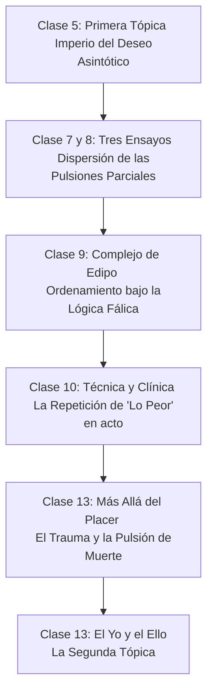

# 📖 GUÍA DOCENTE DE CÁTEDRA: CLASE 13
## *Los Límites del Placer, las Paradojas del Orden y la Reestructuración de la Metapsicología (1920-1923)*

Esta guía tiene como propósito estructurar la Clase 13 articulando los conceptos y la progresión curricular específicos de la **Universidad de Flores (UFLO)** con las explicaciones clínicas, metáforas y giros conceptuales desarrollados en los teóricos y desgrabados de la **Universidad Nacional de La Plata (UNLP)**.

---

## 🗺️ PARTE I: EL CAMINO RECORRIDO (Articulación con las clases previas del Campus)

Para que los estudiantes comprendan la magnitud del giro teórico de los años 20 (bautizado en el programa como *"Las Paradojas del Orden"*), es fundamental reconstruir el mapa con el que venían trabajando. La teoría no cambia por capricho especulativo, sino porque la clínica impone un obstáculo infranqueable para los modelos previos.



### 1. El Imperio del Deseo Asintótico y la Primera Tópica (Clase 5)
*   **La representación espacial del aparato:** En la Clase 5, los alumnos estudiaron el esquema del "peine" (Capítulo VII de *La interpretación de los sueños*), que organiza el aparato en un mapa virtual compuesto por tres sistemas: **Inconsciente (Icc), Preconsciente (Prc) y Conciencia (Cc)**.
*   **El motor es el Deseo:** El aparato no es un receptor pasivo o puramente reactivo a los estímulos del exterior; su fuerza motriz es el deseo inconsciente.
*   **El funcionamiento asintótico del deseo:** El deseo humano no busca calmar una necesidad biológica (el hambre se sacia con comida, pero el deseo no). Su motor es la búsqueda de reasociar las huellas mnémicas de la mítica primera vivencia de satisfacción. Como una curva asintótica (que se aproxima infinitamente al eje cero de descarga absoluta pero por estructura **jamás llega a tocarlo**), el deseo permanece constitutivamente insatisfecho, y es justamente esa insatisfacción estructural lo que mantiene al aparato en constante tensión y movimiento.
*   **El Principio del Placer como Ley Soberana:** En esta primera etapa, el aparato está gobernado de forma absoluta por el principio del placer. El placer se define de forma económica: el aumento de tensión se registra como displacer y la descarga o disminución de excitación se registra como placer. El aparato trabaja para mantener el nivel de excitación lo más bajo posible (homoestasis).

### 2. La sexualidad anárquica infantil (Clase 7 y 8)
*   **Desarticulación del sentido común:** Con la introducción de *Tres ensayos de teoría sexual*, Freud desmonta la definición biológica e intuitiva de la sexualidad (que suponía que nacía en la pubertad, con objeto en el sexo opuesto y meta en el coito reproductivo).
*   **El cuerpo fragmentado ("El Yo Frankenstein"):** La sexualidad humana se descubre como una anarquía original de **pulsiones parciales** ligadas a bordes y orificios corporales (zonas erógenas: boca, ano, mirada, voz). Cada pulsión parcial (oral, anal, escópica, invocante) busca su satisfacción de manera ciega e independiente, de forma **autoerótica**. No hay una integración natural ni un cuerpo unificado al nacer: el cuerpo original es un Frankenstein, un compuesto de piezas dispersas que exigen descarga por separado.

### 3. El ordenamiento edípico, la lógica fálica y el resto autoerótico (Clase 9)
*   **De la dispersión al ordenamiento:** Para que esa anarquía pulsional infantil adquiera un ordenamiento y no devenga puro caos autodestructivo, interviene el **Complejo de Edipo y la castración**.
*   **La ley del Padre:** El Edipo organiza la sexualidad subjetiva a través de la **lógica fálica** y la postulación de la **ley del padre** como ordenador primordial. El padre ordena las elecciones de objeto y regula las metas pulsionales.
*   **El límite del orden (El resto autoerótico):** Este es el enganche metapsicológico clave para la Clase 13. La organización edípica y fálica es sumamente eficaz, pero **no es total ni absoluta**. Siempre queda un **resto autoerótico** que no se subordina a la lógica fálica, una energía libre que escapa al ordenamiento del nombre del padre. Este residuo que no encaja en la ley es el antecedente clínico de la pulsión de muerte.

### 4. La clínica y la repetición de "lo peor" en transferencia (Clase 10)
*   En la Clase 10 (*Recordar, repetir y reelaborar*), los estudiantes vieron que la clínica desborda la simple idea de "hacer consciente lo inconsciente". El paciente no recuerda su pasado edípico reprimido; lo **actúa (Agieren)** en transferencia.
*   **La paradoja clínica:** Si el aparato se rigiera únicamente por la búsqueda de placer, el paciente repetiría las experiencias del pasado más felices. Sin embargo, en la transferencia el sujeto **insiste en repetir lo peor**: los rechazos de los padres, las humillaciones, los desengaños infantiles y las situaciones de castigo. Es una repetición que genera displacer en el presente y que tampoco fue placentera en el pasado. Esta repetición obstinada de lo doloroso pone en cortocircuito la soberanía del principio del placer.

---

## 🌋 PARTE II: EL TERREMOTO METAPSICOLÓGICO DE 1920 (*Más allá del principio del placer*)

### 1. Las excepciones que destronan al Rey Placer
Freud analiza cuatro fenómenos clínicos y cotidianos que demuestran que hay algo en la vida anímica que funciona de manera *independiente y anterior* al principio del placer:
1.  **Las Neurosis de Guerra (Traumáticas):** Soldados que regresan del frente sin heridas físicas graves, pero con un severo padecimiento subjetivo. Su vida onírica está profundamente alterada: cada noche sueñan exactamente con la explosión o el horror que casi los mata, despertando aterrados. Si el sueño es cumplimiento de deseo (Clase 4 bis), este fenómeno lo contradice: el sueño falla en su función y reproduce el dolor.
2.  **El Juego del Fort-Da:** Observación de un niño de un año y medio que arroja sus juguetes emitiendo el sonido *"o-o-o"* (entendido como *Fort* / se fue) y luego los hace reaparecer con un hilo diciendo *"a-a-a"* (entendido como *Da* / acá está). Aunque la segunda parte da placer, el niño repite incansablemente la primera (arrojar y perder el objeto), que escenifica la angustiante partida de su madre. Repite activamente en el juego el trauma pasivo de la separación.
3.  **La Transferencia Negativa:** La reactivación en el análisis de los sentimientos de odio, abandono y frustración dirigidos originalmente a los padres, que el paciente vive como actuales e intolerables frente al terapeuta.
4.  **La Compulsión de Destino:** Personas que parecen perseguidas por un destino trágico en sus relaciones (amigos que siempre los traicionan, parejas que los abandonan). Freud recurre al mito literario de **Tancredo y Clorinda** (*La Jerusalén Liberada*): Tancredo mata en duelo a su amada Clorinda sin saberlo (pues ella vestía armadura enemiga) y, tiempo después, en un bosque encantado, clava su espada en un árbol del cual mana sangre y escucha la voz de Clorinda reclamándole que la ha vuelto a herir. **El sujeto actúa de forma que repite activamente aquello que más quiere evitar.**

### 2. El modelo de la vesícula y la protección antiestímulo (Capítulo IV)
Para explicar el trauma, Freud propone una topología celular simplificada:
*   **La vesícula estimulable:** Imaginemos el aparato psíquico como una esfera viva suspendida en un medio externo hostil. El exterior posee cantidades infinitas de energía (estímulos) comparadas con el interior.
*   **La membrana protectora (Protección antiestímulo):** La superficie de esta vesícula se endurece para actuar como un escudo protector. Su función no es percibir, sino **filtrar y atenuar** los estímulos externos, reduciéndolos a magnitudes tolerables para el interior.
*   **La definición de Trauma:** El trauma es la **perforación** de esta corteza protectora antiestímulo. Cuando la barrera se rompe, cantidades masivas de **energía libre** inundan el aparato psíquico sin ser filtradas.

```
       MUNDO EXTERIOR (Cantidades infinitas de energía)
                    │   │   │   │
                    ▼   ▼   ▼   ▼
             ┌─────────────────────┐
             │ BARRERA PROTECTORA  │  ◄─── [TRAUMA: Perforación de la barrera]
             └──────────┬──────────┘
                         │ (Inundación de energía libre)
                         ▼
             ┌─────────────────────┐
             │  APARATO PSÍQUICO   │  ◄─── [Urgencia: Ligar la energía libre]
             └─────────────────────┘
```

### 3. La tarea originaria de ligar y la metáfora del Titanic
*   **La ligazón (Bindung):** Cuando el trauma ocurre, el funcionamiento normal bajo el principio del placer queda **suspendido (destronado)**. El aparato no puede dedicarse a buscar placer o evitar displacer cuando está inundado y en peligro de disolverse. Su tarea urgente, vital y previa es **ligar** (fijar, amarrar) esa energía libre a representaciones y huellas psíquicas para transformarla en energía en reposo.
*   **La Metáfora del Titanic y el Pocillito (Teórico de Septiembre 4):**
    > *"Imaginemos que vamos en el Titanic y se rompe el casco, empieza a entrar agua de forma masiva (trauma). El funcionamiento placentero del barco (la orquesta, la cena) se suspende. Lo único que nos queda es agarrar un pocillito de café y empezar a sacar agua desesperadamente (repetición compulsiva). Sacar agua con un pocillito no da placer, no soluciona el problema de fondo, pero es un intento desesperado de dominio y ligazón del exceso antes de que el barco se hunda. Solo cuando el nivel de agua esté controlado (energía ligada), podrá volver a funcionar la orquesta y reinar la lógica del placer."*
*   **La repetición en el trauma:** El sueño repetitivo de la neurosis de guerra o la repetición del juego no buscan un placer oculto, sino que son el intento desesperado de ligar la energía libre introduciendo una preparación angustiosa que faltó en el momento del accidente (el factor sorpresa).

### 4. El trauma estructural de la pulsión
*   **El interior sin barrera:** Freud da un paso fundamental: la vesícula tiene capa protectora contra el exterior, pero **no tiene protección contra los estímulos del interior (las pulsiones)**.
*   **La pulsión como trauma constitutivo:** Esto significa que el estímulo pulsional es, en sí mismo y desde el origen, traumático para el aparato. El trauma no es un accidente ocasional que le ocurre a algunos soldados; **el trauma nos atañe a todos porque llevamos la pulsión adentro**.
*   **El nuevo dualismo pulsional:**
    *   **Pulsión de Vida (Eros):** Aquella parte de la pulsión que logra ser ligada a representaciones (palabras, imágenes, huellas), permitiendo el deseo, la creación de unidades complejas y la vida del aparato.
    *   **Pulsión de Muerte (Tánatos):** Aquella parte de la pulsión que permanece como un resto inasimilable, no ligado (energía libre). Opera silenciosamente empujando al aparato a disolver las conexiones y retornar al estado de inercia inorgánica (la muerte).

---

## 🏛️ PARTE III: LA RECONSTRUCCIÓN ESTRUCTURAL (El yo y el ello - 1923)

El descubrimiento de la pulsión de muerte y de resistencias clínicas insuperables obliga a abandonar la Primera Tópica.

### 1. ¿Por qué cae la Primera Tópica? (El Yo Inconsciente)
*   **El Yo reprime y opone resistencia en la cura:** En la transferencia, el analista constata que el Yo defiende sus fronteras para evitar que lo reprimido emerja.
*   **La resistencia es inconsciente:** Sin embargo, el paciente no sabe que se está resistiendo. La defensa se ejecuta de forma muda, sin que el sujeto tenga conciencia de ella.
*   **La paradoja:** Si el Yo (agente de la represión) tiene una parte inconsciente, entonces "Inconsciente" ya no puede ser el nombre de un sistema o lugar contrapuesto al Yo.
*   **De Sistema a Cualidad:** "Inconsciente" deja de ser una localización y pasa a ser una **cualidad** descriptiva de ciertos procesos psíquicos.

### 2. Las Tres Acepciones del Inconsciente (Pregunta típica de examen)
Freud delimita tres formas de entender lo inconsciente:
1.  **Descriptivo:** Todo proceso psíquico que no está actualmente en la conciencia. Abarca tanto lo que es **latente** (preconsciente, que con un esfuerzo de atención o memoria puede retornar a la conciencia) como lo **insusceptible de conciencia**.
2.  **Dinámico:** Lo reprimido. Se define estrictamente por el **conflicto de fuerzas** entre lo reprimido (que insiste por manifestarse a través de síntomas, sueños, fallas) y lo represor (el Yo que opone resistencia para mantenerlo segregado).
3.  **Sistemático:** El inconsciente concebido como un sistema espacial con leyes y modos de funcionamiento propios, regido exclusivamente por el **proceso primario** (condensación y desplazamiento, atemporalidad y ausencia de contradicción).

### 3. La Segunda Tópica: El Yo coherente y sus tres amos
Frente a la insuficiencia del viejo esquema, Freud dibuja su mapa definitivo del aparato: Yo, Ello y Superyó.

```
                       ┌───────────────────────┐
                       │      SUPER-YO         │ (Heredero del Edipo - Culpa y Ley)
                       └──────────┬────────────┘
                                  │ (Exigencias morales tiránicas)
                                  ▼
    ┌───────────┐      ┌───────────────────────┐      ┌───────────┐
    │ REALIDAD  │ ◄─── │         YO            │ ◄─── │   ELLO    │ (Reservorio pulsional)
    └───────────┘      └───────────────────────┘      └───────────┘
     (Obstáculos)       (El jinete y el caballo)       (Exigencias pulsionales)
```

*   **El Ello:** El gran reservorio de la pulsión. Es caótico, no tiene organización temporal ni lógica, y se rige puramente por el proceso primario. En él habitan tanto las pulsiones de vida (ligadas a representaciones inconscientes) como la pulsión de muerte (el resto no ligado).
*   **El Yo:** No es originario; se diferencia a partir del contacto del Ello con la Realidad externa (sistema percepción-conciencia) para mediar en la supervivencia del sujeto.
    *   *La metáfora del Jinete y el Caballo:* El Ello es el caballo salvaje que provee la fuerza de tracción (la energía); el Yo es el jinete que intenta dirigirlo. A menudo, el jinete debe llevar al caballo a donde este quiere ir para no ser descabalgado, aunque luego racionalice la acción pretendiendo que él dirigió el rumbo.
    *   *El Yo Vasallo:* El Yo no es autónomo ni soberano; es un esclavo que sirve a **tres amos contradictorios**:
        1.  Las exigencias pulsionales del **Ello**.
        2.  Los límites y obstáculos de la **Realidad externa**.
        3.  Los mandatos tiránicos del **Superyó**.
*   **El Superyó:** Heredero del Complejo de Edipo. Se constituye por la interiorización de la instancia paterna (los ideales, normas y prohibiciones de los padres). El Superyó se independiza del exterior; ya no hace falta que el padre real vigile al niño, la voz de la ley está instalada dentro del aparato. El Superyó se alimenta de la agresión desunida (pulsión de muerte) del Ello para juzgar sádicamente al Yo, produciendo el **sentimiento inconsciente de culpa** y la necesidad de autocastigo.

---

## 🏛️ PARTE IV: LAS CINCO RESISTENCIAS (*Inhibición, síntoma y angustia* - 1926)

Como consecuencia de este mapa dinámico, en el apéndice de *Inhibición, síntoma y angustia* Freud sistematiza los diferentes tipos de obstáculos que se oponen a la cura. Si "resistencia" es todo lo que frena el análisis, ahora debemos catalogarlas según la instancia del aparato de la cual provienen:

```
                               ┌────────────────────────────────┐
                               │   LAS 5 VÍAS DE LA RESISTENCIA │
                               └──────────────┬─────────────────┘
                                              │
                     ┌────────────────────────┼────────────────────────┐
                     ▼                        ▼                        ▼
             [ RESISTENCIAS DEL YO ]       [ RESISTENCIA DEL ELLO ]  [ RESISTENCIA DEL SUPERYÓ ]
                     │                        │                        │
       ┌─────────────┼─────────────┐          ▼                        ▼
       ▼             ▼             ▼    (Compulsión de Repetición) (Culpa Inconsciente /
  (Represión)  (Transferencia) (Ganancia                               Necesidad de Castigo)
                               Secundaria)
```

### A. Provenientes del YO
1.  **Resistencia de Represión:** Es la forma más clásica. Es la fuerza con la que el Yo mantiene segregado lo reprimido, impidiendo que los recuerdos traumáticos o displacenteros accedan a la asociación libre y a la conciencia.
2.  **Resistencia de Transferencia:** El yo del paciente utiliza la relación con el analista para detener las asociaciones. El sujeto prefiere ser amado, odiado o juzgado por el analista (actuar el vínculo imaginario) antes que recordar y poner en palabras sus conflictos históricos. El diván es el dispositivo técnico diseñado específicamente para atenuar este eje imaginario cara a cara.
3.  **Resistencia por Beneficio Secundario del Síntoma:** El Yo busca integrar el síntoma a su propia coherencia y unidad para obtener alguna ventaja de él.
    *   *La Metáfora de la Pierna Amputada (Teórico de Septiembre 4):*
        > *"Supongamos que un hombre sufre un accidente y pierde una pierna. Esto le produce un dolor y un perjuicio inmenso. Sin embargo, con el tiempo, descubre que esa desgracia le permite obtener una pensión del Estado o dedicarse a la mendicidad y vivir de la limosna sin trabajar. El dolor es real, pero ahora el sujeto ha encontrado un beneficio en su desventura. Si un médico viene a ofrecerle una pierna ortopédica milagrosa para que vuelva a caminar y a trabajar, el sujeto se resistirá inconscientemente porque perdería sus privilegios de lisiado. Eso es el beneficio secundario del síntoma: el Yo se aferra a la enfermedad por la ganancia que extrajo de ella."*

### B. Proveniente del ELLO
4.  **Resistencia del Ello (Compulsión de repetición / Adhesividad de la libido):** Proviene de la inercia propia de las pulsiones del Ello. Las huellas pulsionales se resisten a cambiar de dirección o a abandonar los antiguos canales de descarga. Es una resistencia muda que exige un arduo trabajo de elaboración (*Durcharbeitung*) en el análisis, ya que la libido se adhiere obstinadamente a sus primeros objetos y modos de satisfacción.

### C. Proveniente del SUPERYÓ
5.  **Resistencia del Superyó (Sentimiento de culpa inconsciente / Necesidad de castigo):** Es el obstáculo clínico más temible y enigmático (la "reacción terapéutica negativa"). Cuando el analista espera que el paciente mejore porque ha elaborado sus conflictos, el paciente empeora drásticamente. El sujeto se aferra al sufrimiento del síntoma porque lo vive como un castigo necesario que calma la severidad sádica de su Superyó. Para el Superyó, la curación equivale a una transgresión de la ley internalizada; el paciente "debe" sufrir para expiar su culpa.

---

## 📝 SUGERENCIAS PEDAGÓGICAS PARA EL DICTADO DE LA CLASE

1.  **El Pizarrón del Viraje Tópico:**
    Es sumamente clarificador dibujar en el pizarrón dos esquemas comparativos:
    *   *A la izquierda, la Primera Tópica:* Un esquema horizontal donde el conflicto es lineal (Conciencia vs. Inconsciente), con la barrera de la censura en el medio.
    *   *A la derecha, la Segunda Tópica:* Un esquema tridimensional donde el Yo y el Superyó sumergen sus raíces inconscientes en el caldero del Ello, mostrando gráficamente que el límite no es una línea limpia sino una intrincada zona de conflicto dinámico.
2.  **Pregunta Detonadora para la Clase:**
    Iniciar el teórico interpelando directamente a los alumnos:
    *¿Si la mente humana busca por definición evitar el sufrimiento y conseguir la felicidad (Principio del Placer), cómo explicamos que los seres humanos tropecemos una y otra vez con la misma piedra dolorosa, elijamos parejas que nos hacen sufrir y nos resistamos inconscientemente a curarnos en los tratamientos?*
3.  **El Puente hacia el Cierre de la Unidad (Clase 15):**
    Finalizar la clase planteando que este nuevo mapa del aparato psíquico (el Yo asediado por el Ello y el Superyó) no solo sufre en la intimidad de la clínica, sino que tiene consecuencias directas al salir al mundo exterior. En la Clase 15, veremos cómo la convivencia en la civilización exige una renuncia pulsional masiva, cuyo resto agresivo retorna como culpa social en *El malestar en la cultura*.
